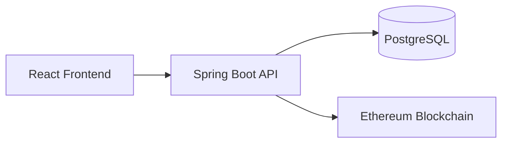
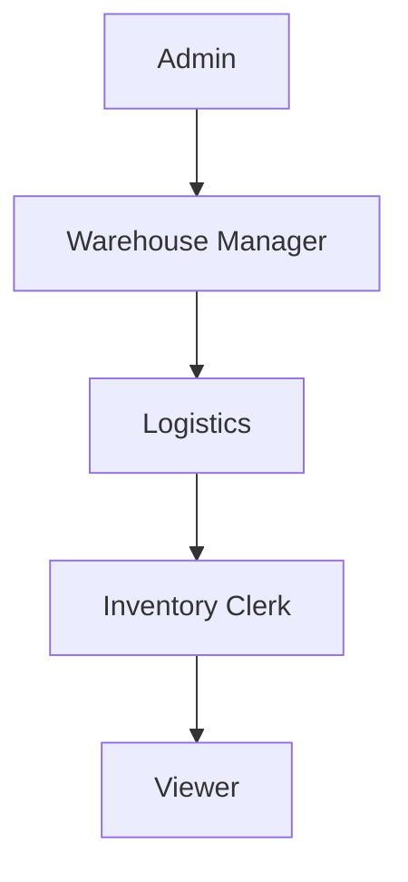
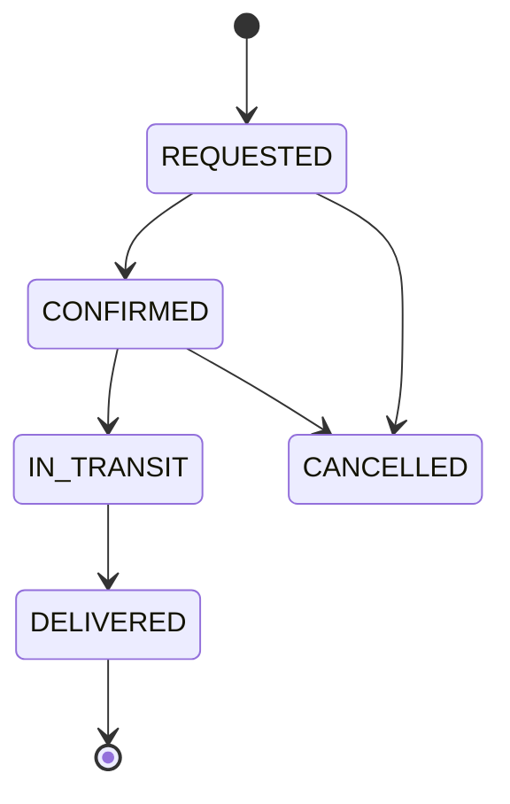
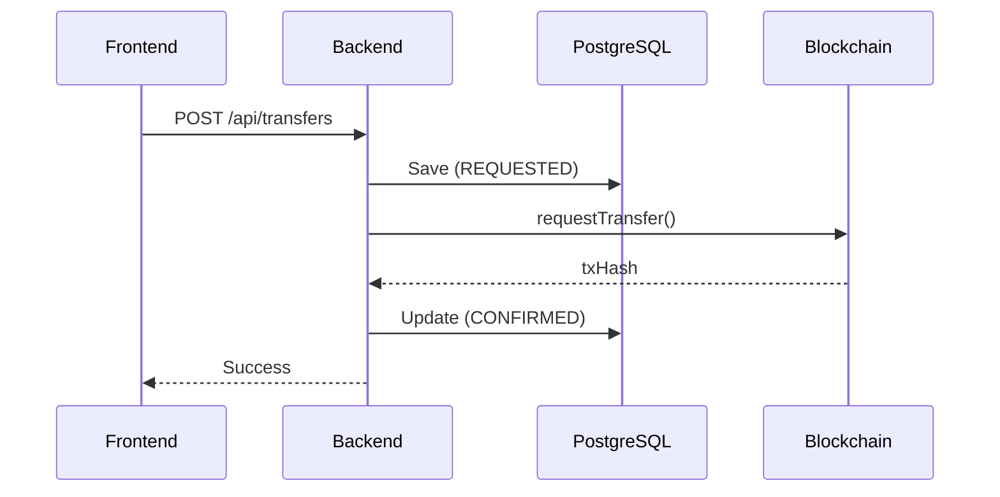

# Inventory Blockchain - Supply Chain Transfer Platform

A full-stack supply chain management system with blockchain verification and role-based access control. Built with Spring Boot, React, PostgreSQL, and Ethereum smart contracts.


---

## 📋 Overview

This platform demonstrates a hybrid off-chain/on-chain architecture for enterprise supply chain management:

- **Off-chain (PostgreSQL)**: Stores complete transfer details, user data, optimized for queries
- **On-chain (Ethereum)**: Stores cryptographic proof (hash) for immutable audit trail
- **Role-Based Access**: 5-tier permission system for secure operations

---

## 🏗️ Architecture



| Component | Technology | Port |
|-----------|------------|------|
| Frontend | React + Vite | 3000 |
| Backend | Spring Boot 3 | 8080 |
| Database | PostgreSQL | 5432 |
| Blockchain | Hardhat | 8545 |

---

## ✨ Features

### 🔐 Role-Based Access Control



| Role | Access Level | Key Permissions |
|------|--------------|-----------------|
| **Admin** | Full | Everything + User Management |
| **Warehouse Manager** | High | Create, Cancel, Approve, Update |
| **Logistics** | Medium | Update Delivery Status |
| **Inventory Clerk** | Basic | Create Transfers, View |
| **Viewer** | Minimal | View Inventory Only |

### 📊 Dashboard Pages

| Page | Description | Access |
|------|-------------|--------|
| Dashboard | Stats & Alerts | All Users |
| Transfers | Manage Orders | Manager+ |
| New Transfer | Create Orders | Clerk+ |
| Inventory | Stock Levels | All Users |
| Reports | Analytics | Clerk+ |
| Users | User Management | Admin Only |

### 📦 Transfer Status Workflow



| Status | Description |
|--------|-------------|
| `REQUESTED` | Order created, recorded on blockchain |
| `CONFIRMED` | Approved by manager |
| `IN_TRANSIT` | Shipment on the way |
| `DELIVERED` | Successfully received |
| `CANCELLED` | Order cancelled |

---

## 📁 Project Structure

```
inventory-blockchain/
├── backend/
│   └── supply-chain-platform/
│       ├── pom.xml
│       └── src/main/java/com/inventory/blockchain/
│           ├── config/
│           ├── controller/
│           ├── dto/
│           ├── entity/
│           ├── exception/
│           ├── repository/
│           ├── service/
│           └── util/
├── frontend/
│   ├── package.json
│   └── src/
│       ├── App.jsx
│       └── main.jsx
└── chain/
    ├── hardhat.config.js
    ├── contracts/
    │   └── TransferLedger.sol
    └── scripts/
        └── deploy.js
```

---

## 🚀 Quick Start

### Prerequisites

- Java 21+
- Maven 3.8+
- Node.js 18+
- PostgreSQL 14+

### Setup Steps

**1. Clone & Setup Database**
```bash
git clone https://github.com/Zag009/inventory-blockchain.git
cd inventory-blockchain
psql -U postgres -c "CREATE DATABASE inventory_db;"
```

**2. Start Blockchain (Terminal 1)**
```bash
cd chain
npm install
npx hardhat node
```

**3. Deploy Contract (Terminal 2)**
```bash
cd chain
npx hardhat run scripts/deploy.js --network localhost
```

**4. Start Backend (Terminal 3)**
```bash
cd backend/supply-chain-platform
mvn spring-boot:run
```

**5. Start Frontend (Terminal 4)**
```bash
cd frontend
npm install
npm run dev
```

**6. Open Browser**
```
http://localhost:3000
```

---

## 🔑 Demo Accounts

| Username | Password | Role |
|----------|----------|------|
| `admin` | `admin123` | Administrator |
| `manager` | `manager123` | Warehouse Manager |
| `logistics` | `logistics123` | Logistics |
| `clerk` | `clerk123` | Inventory Clerk |
| `viewer` | `viewer123` | Viewer |

---

## 📡 API Endpoints

| Method | Endpoint | Description |
|--------|----------|-------------|
| `GET` | `/api/transfers` | List all transfers |
| `POST` | `/api/transfers` | Create new transfer |
| `GET` | `/api/transfers/{id}` | Get transfer by ID |
| `PUT` | `/api/transfers/{id}/status` | Update status |

### Create Transfer Example

```bash
curl -X POST http://localhost:8080/api/transfers \
  -H "Content-Type: application/json" \
  -d '{
    "transferId": "TRF-001",
    "fromLocation": "WAREHOUSE-NORTH-01",
    "toLocation": "STORE-DOWNTOWN-001",
    "items": [
      {"sku": "ELEC-TV-55-4K", "qty": 10}
    ]
  }'
```

---

## 🧠 How It Works

### Two-Phase Commit



### Data Flow

1. **User** creates transfer request via UI
2. **Backend** saves to PostgreSQL with `REQUESTED` status
3. **Backend** sends transaction to blockchain
4. **Blockchain** returns transaction hash and block number
5. **Backend** updates PostgreSQL with `CONFIRMED` status
6. **User** sees confirmed transfer with blockchain proof

---

## 🔒 Permission Matrix

| Action | Admin | Manager | Logistics | Clerk | Viewer |
|--------|:-----:|:-------:|:---------:|:-----:|:------:|
| Create Transfer | ✅ | ✅ | ❌ | ✅ | ❌ |
| Cancel Transfer | ✅ | ✅ | ❌ | ❌ | ❌ |
| Approve Transfer | ✅ | ✅ | ❌ | ❌ | ❌ |
| Update Status | ✅ | ✅ | ✅ | ❌ | ❌ |
| View Transfers | ✅ | ✅ | ✅ | ✅ | ❌ |
| View Inventory | ✅ | ✅ | ✅ | ✅ | ✅ |
| View Reports | ✅ | ✅ | ✅ | ✅ | ❌ |
| Manage Users | ✅ | ❌ | ❌ | ❌ | ❌ |

---

## 🛠️ Tech Stack

| Layer | Technologies |
|-------|--------------|
| **Frontend** | React 18, Vite 5, CSS-in-JS |
| **Backend** | Spring Boot 3.3, Java 21, Maven |
| **Database** | PostgreSQL 14+, Spring Data JPA |
| **Blockchain** | Solidity 0.8.20, Hardhat, web3j |

---

## ⚙️ Environment Variables

```bash
# Database
SPRING_DATASOURCE_URL=jdbc:postgresql://localhost:5432/inventory_db
SPRING_DATASOURCE_USERNAME=postgres
SPRING_DATASOURCE_PASSWORD=your_password

# Blockchain
HARDHAT_RPC_URL=http://127.0.0.1:8545
CONTRACT_ADDRESS=0x5FbDB2315678afecb367f032d93F642f64180aa3
CHAIN_ID=31337
```

---

## 📄 License

MIT License - Portfolio Project

---

## 👨‍💻 Author

**Zag009**

Full-stack blockchain project demonstrating:
- Spring Boot backend development
- React frontend
- Ethereum smart contracts
- Role-based access control
- Supply chain domain

---

⭐ **Star this repo if you find it useful!**
