# Inventory Blockchain - Supply Chain Transfer Platform

A full-stack supply chain management system with blockchain verification and role-based access control. Built with Spring Boot, React, PostgreSQL, and Ethereum smart contracts.


---

## 📋 Overview

This platform demonstrates a hybrid off-chain/on-chain architecture for enterprise supply chain management:

- **Off-chain (PostgreSQL)**: Stores complete transfer details, user data, optimized for queries
- **On-chain (Ethereum)**: Stores cryptographic proof (hash) for immutable audit trail
- **Role-Based Access**: 5-tier permission system for secure operations

---

## 🏗️ Architecture


---

## ✨ Features

### 🔐 Role-Based Access Control

```mermaid
graph TD
    subgraph Roles
        A[👑 ADMIN<br/>Level 5]
        B[📦 WAREHOUSE MANAGER<br/>Level 4]
        C[🚚 LOGISTICS<br/>Level 3]
        D[📋 INVENTORY CLERK<br/>Level 2]
        E[👁️ VIEWER<br/>Level 1]
    end
    
    A -->|Full Access| ALL[All Features + User Management]
    B -->|Manage| MANAGE[Create, Cancel, Approve, Update Status, View All]
    C -->|Delivery| DELIVERY[Update Delivery Status, View Transfers & Inventory]
    D -->|Stock| STOCK[Create Transfers, View Inventory & Reports]
    E -->|Read Only| VIEW[View Inventory Only]
    
    style A fill:#ef4444,color:#fff
    style B fill:#8b5cf6,color:#fff
    style C fill:#3b82f6,color:#fff
    style D fill:#10b981,color:#fff
    style E fill:#6b7280,color:#fff
```



### 📊 Dashboard Pages

```mermaid
graph LR
    subgraph Pages
        DASH[📊 Dashboard]
        TRANS[📦 Transfers]
        NEW[➕ New Transfer]
        INV[📋 Inventory]
        REP[📈 Reports]
        USR[👥 Users]
    end
    
    DASH -->|All Users| A1[Stats & Alerts]
    TRANS -->|Manager+| A2[Filter & Manage]
    NEW -->|Clerk+| A3[Create Orders]
    INV -->|All Users| A4[Stock Levels]
    REP -->|Clerk+| A5[Analytics]
    USR -->|Admin Only| A6[User Management]
```



### 📦 Transfer Status Workflow


### 🏷️ Real-World SKU Catalog

40+ products across 7 categories:
- **Electronics** - TVs, Laptops, Phones, Tablets, Headphones
- **Furniture** - Office chairs, Desks, Shelves, Cabinets
- **Apparel** - Shirts, Pants, Jackets, Shoes (with sizes)
- **Food & Beverage** - Packaged goods, Beverages
- **Pharmaceuticals** - Vitamins, Medical supplies
- **Automotive** - Motor oil, Brake pads, Batteries
- **Office Supplies** - Paper, Pens, Folders

### ⛓️ Blockchain Verification

- Every transfer recorded on Ethereum
- Immutable audit trail with transaction hash
- Deterministic item hashing (Keccak256)
- Tamper-evident proof of transfer integrity

---

## 📁 Project Structure


---

## 🚀 Quick Start

### Prerequisites

- Java 21 or later
- Maven 3.8+
- Node.js 18+ and npm
- PostgreSQL 14+

### Step 1: Clone the Repository

```bash
git clone https://github.com/Zag009/inventory-blockchain.git
cd inventory-blockchain
```

### Step 2: Database Setup

```bash
psql -U postgres -c "CREATE DATABASE inventory_db;"
```

### Step 3: Start Blockchain (Terminal 1)

```bash
cd chain
npm install
npx hardhat node
```

### Step 4: Deploy Smart Contract (Terminal 2)

```bash
cd chain
npx hardhat run scripts/deploy.js --network localhost
```

### Step 5: Start Backend (Terminal 3)

```bash
cd backend/supply-chain-platform
mvn spring-boot:run
```

### Step 6: Start Frontend (Terminal 4)

```bash
cd frontend
npm install
npm run dev
```

### Step 7: Open Browser

Navigate to: **http://localhost:3000**

---

## 🔑 Demo Accounts

| Username | Password | Role | Access Level |
|----------|----------|------|--------------|
| `admin` | `admin123` | Administrator | Full access |
| `manager` | `manager123` | Warehouse Manager | Manage all |
| `logistics` | `logistics123` | Logistics | Update status |
| `clerk` | `clerk123` | Inventory Clerk | Create/View |
| `viewer` | `viewer123` | Viewer | View only |

---

## 📡 API Endpoints

### Transfers API

| Method | Endpoint | Description |
|--------|----------|-------------|
| `GET` | `/api/transfers` | List all transfers |
| `POST` | `/api/transfers` | Create new transfer |
| `GET` | `/api/transfers/{id}` | Get transfer by ID |
| `PUT` | `/api/transfers/{id}/status` | Update transfer status |

### Health Check

| Method | Endpoint | Description |
|--------|----------|-------------|
| `GET` | `/actuator/health` | Application health status |

### Example: Create Transfer

```bash
curl -X POST http://localhost:8080/api/transfers \
  -H "Content-Type: application/json" \
  -d '{
    "transferId": "TRF-001",
    "fromLocation": "WAREHOUSE-NORTH-01",
    "toLocation": "STORE-DOWNTOWN-001",
    "items": [
      {"sku": "ELEC-TV-55-4K", "qty": 10},
      {"sku": "ELEC-LAPTOP-PRO", "qty": 5}
    ]
  }'
```

### Example: Update Status

```bash
curl -X PUT http://localhost:8080/api/transfers/TRF-001/status \
  -H "Content-Type: application/json" \
  -d '{"status": "IN_TRANSIT"}'
```

---

## ⚙️ Environment Variables

```bash
# Database
SPRING_DATASOURCE_URL=jdbc:postgresql://localhost:5432/inventory_db
SPRING_DATASOURCE_USERNAME=postgres
SPRING_DATASOURCE_PASSWORD=your_password

# Blockchain
HARDHAT_RPC_URL=http://127.0.0.1:8545
CONTRACT_ADDRESS=0x5FbDB2315678afecb367f032d93F642f64180aa3
SENDER_PRIVATE_KEY=0xac0974bec39a17e36ba4a6b4d238ff944bacb478cbed5efcae784d7bf4f2ff80
CHAIN_ID=31337
```

---

## 🛠️ Tech Stack


---

## 🔒 Permission Matrix

| Action | Admin | Manager | Logistics | Clerk | Viewer |
|--------|:-----:|:-------:|:---------:|:-----:|:------:|
| Create Transfer | ✅ | ✅ | ❌ | ✅ | ❌ |
| Cancel Transfer | ✅ | ✅ | ❌ | ❌ | ❌ |
| Approve Transfer | ✅ | ✅ | ❌ | ❌ | ❌ |
| Update Status | ✅ | ✅ | ✅ | ❌ | ❌ |
| View All Transfers | ✅ | ✅ | ✅ | ✅ | ❌ |
| View Inventory | ✅ | ✅ | ✅ | ✅ | ✅ |
| View Reports | ✅ | ✅ | ✅ | ✅ | ❌ |
| Manage Users | ✅ | ❌ | ❌ | ❌ | ❌ |

---

## 🧠 How It Works

### Two-Phase Commit Pattern


### Deterministic Hashing

Items are hashed using a canonical JSON format:

1. Sort items by SKU
2. Sort object keys alphabetically
3. Remove whitespace
4. Apply Keccak256 hash

This ensures the same items always produce the same hash, enabling verification.

---

## 📸 Screenshots

### Login Page
- Secure authentication with role-based access
- Demo account credentials displayed for testing

### Dashboard
- Real-time statistics (Total, Pending, In Transit, Delivered)
- Recent transfers table
- Low stock alerts panel

### Transfers Management
- Filter transfers by status
- One-click status updates
- Cancel functionality for authorized users
- Blockchain proof modal with txHash

### Inventory
- Search by SKU, product name, or location
- Filter by location and category
- Low stock indicators
- Total inventory value calculation

### Reports & Analytics
- Stock value by location (bar charts)
- Transfer status distribution
- Category breakdown
- Low stock summary by location

---

## 📄 License

MIT License - Built for portfolio demonstration

---

## 👨‍💻 Author

**Zag009**

Full-stack blockchain portfolio project demonstrating:
- Enterprise Java development (Spring Boot)
- Modern React frontend
- Ethereum smart contract integration
- Role-based access control
- Supply chain domain knowledge

---

⭐ **Star this repo if you find it useful!**
