# Inventory Blockchain - Supply Chain Transfer Platform

A full-stack supply chain management system with blockchain verification and role-based access control. Built with Spring Boot, React, PostgreSQL, and Ethereum smart contracts.


---

## 📋 Overview

This platform demonstrates a hybrid off-chain/on-chain architecture for enterprise supply chain management:

- **Off-chain (PostgreSQL)**: Stores complete transfer details, user data, optimized for queries
- **On-chain (Ethereum)**: Stores cryptographic proof (hash) for immutable audit trail
- **Role-Based Access**: 5-tier permission system for secure operations

---

## 🏗️ Architecture


| Component | Technology | Port |
|-----------|------------|------|
| Frontend | React + Vite | 3000 |
| Backend | Spring Boot 3 | 8080 |
| Database | PostgreSQL | 5432 |
| Blockchain | Hardhat | 8545 |

---

## ✨ Features

### 🔐 Role-Based Access Control

```mermaid
graph TB
    A[👑 Admin<br/>Full Access]
    B[📦 Warehouse Manager<br/>Manage Operations]
    C[🚚 Logistics<br/>Update Deliveries]
    D[📋 Inventory Clerk<br/>Create & View]
    E[👁️ Viewer<br/>Read Only]
    
    A --- B
    B --- C
    C --- D
    D --- E
```



| Role | Access Level | Key Permissions |
|------|--------------|-----------------|
| **Admin** | Level 5 | Everything + User Management |
| **Warehouse Manager** | Level 4 | Create, Cancel, Approve, Update Status |
| **Logistics** | Level 3 | Update Delivery Status, View All |
| **Inventory Clerk** | Level 2 | Create Transfers, View Inventory & Reports |
| **Viewer** | Level 1 | View Inventory Only |

### 📊 Dashboard Pages

| Page | Description | Access |
|------|-------------|--------|
| 📊 Dashboard | Overview stats, recent transfers, low stock alerts | All Users |
| 📦 Transfers | All transfers with filtering and status management | Manager+ |
| ➕ New Transfer | Create blockchain-verified transfer requests | Clerk+ |
| 📋 Inventory | Stock levels by location with search and filters | All Users |
| 📈 Reports | Analytics, charts, stock value by location | Clerk+ |
| 👥 Users | User management and permission matrix | Admin Only |

### 📦 Transfer Status Workflow


| Status | Description | Next Actions |
|--------|-------------|--------------|
| `REQUESTED` | Order created, recorded on blockchain | Confirm or Cancel |
| `CONFIRMED` | Approved by manager, ready for shipping | Ship or Cancel |
| `IN_TRANSIT` | Shipment on the way | Deliver or Cancel |
| `DELIVERED` | Successfully received and verified | Complete |
| `CANCELLED` | Order cancelled at any stage | None |

---

## 📁 Project Structure

```
inventory-blockchain/
│
├── backend/
│   └── supply-chain-platform/
│       ├── pom.xml
│       └── src/main/java/com/inventory/blockchain/
│           ├── config/          # Web3, CORS configuration
│           ├── controller/      # REST endpoints
│           ├── dto/             # Request/Response objects
│           ├── entity/          # JPA entities
│           ├── exception/       # Error handling
│           ├── repository/      # Data access
│           ├── service/         # Business logic
│           └── util/            # Hash utilities
│
├── frontend/
│   ├── package.json
│   ├── vite.config.js
│   └── src/
│       ├── App.jsx              # Main app with all pages
│       └── main.jsx
│
└── chain/
    ├── package.json
    ├── hardhat.config.js
    ├── contracts/
    │   └── TransferLedger.sol
    └── scripts/
        └── deploy.js
```

---

## 🚀 Quick Start

### Prerequisites

- Java 21 or later
- Maven 3.8+
- Node.js 18+ and npm
- PostgreSQL 14+

### Step 1: Clone the Repository

```bash
git clone https://github.com/Zag009/inventory-blockchain.git
cd inventory-blockchain
```

### Step 2: Database Setup

```bash
psql -U postgres -c "CREATE DATABASE inventory_db;"
```

### Step 3: Start Blockchain (Terminal 1)

```bash
cd chain
npm install
npx hardhat node
```

### Step 4: Deploy Smart Contract (Terminal 2)

```bash
cd chain
npx hardhat run scripts/deploy.js --network localhost
```

### Step 5: Start Backend (Terminal 3)

```bash
cd backend/supply-chain-platform
mvn spring-boot:run
```

### Step 6: Start Frontend (Terminal 4)

```bash
cd frontend
npm install
npm run dev
```

### Step 7: Open Browser

Navigate to: **http://localhost:3000**

---

## 🔑 Demo Accounts

| Username | Password | Role | Access |
|----------|----------|------|--------|
| `admin` | `admin123` | Administrator | Full access |
| `manager` | `manager123` | Warehouse Manager | Manage all |
| `logistics` | `logistics123` | Logistics | Update status |
| `clerk` | `clerk123` | Inventory Clerk | Create/View |
| `viewer` | `viewer123` | Viewer | View only |

---

## 📡 API Endpoints

### Transfers API

| Method | Endpoint | Description |
|--------|----------|-------------|
| `GET` | `/api/transfers` | List all transfers |
| `POST` | `/api/transfers` | Create new transfer |
| `GET` | `/api/transfers/{id}` | Get transfer by ID |
| `PUT` | `/api/transfers/{id}/status` | Update transfer status |

### Health Check

| Method | Endpoint | Description |
|--------|----------|-------------|
| `GET` | `/actuator/health` | Application health status |

### Example: Create Transfer

```bash
curl -X POST http://localhost:8080/api/transfers \
  -H "Content-Type: application/json" \
  -d '{
    "transferId": "TRF-001",
    "fromLocation": "WAREHOUSE-NORTH-01",
    "toLocation": "STORE-DOWNTOWN-001",
    "items": [
      {"sku": "ELEC-TV-55-4K", "qty": 10},
      {"sku": "ELEC-LAPTOP-PRO", "qty": 5}
    ]
  }'
```

### Example: Update Status

```bash
curl -X PUT http://localhost:8080/api/transfers/TRF-001/status \
  -H "Content-Type: application/json" \
  -d '{"status": "IN_TRANSIT"}'
```

---

## 🧠 How It Works

### Two-Phase Commit Pattern


| Step | Component | Action |
|------|-----------|--------|
| 1 | Frontend | User submits transfer request |
| 2 | Backend → DB | Save transfer with REQUESTED status |
| 3 | Backend → Blockchain | Call requestTransfer() on smart contract |
| 4 | Blockchain → Backend | Return transaction hash and block number |
| 5 | Backend → DB | Update transfer with CONFIRMED status |
| 6 | Backend → Frontend | Return success with blockchain proof |

### Deterministic Hashing

Items are hashed using a canonical JSON format:

1. Sort items by SKU
2. Sort object keys alphabetically
3. Remove whitespace
4. Apply Keccak256 hash

This ensures the same items always produce the same hash, enabling verification.

---

## 🔒 Permission Matrix

| Action | Admin | Manager | Logistics | Clerk | Viewer |
|--------|:-----:|:-------:|:---------:|:-----:|:------:|
| Create Transfer | ✅ | ✅ | ❌ | ✅ | ❌ |
| Cancel Transfer | ✅ | ✅ | ❌ | ❌ | ❌ |
| Approve Transfer | ✅ | ✅ | ❌ | ❌ | ❌ |
| Update Status | ✅ | ✅ | ✅ | ❌ | ❌ |
| View Transfers | ✅ | ✅ | ✅ | ✅ | ❌ |
| View Inventory | ✅ | ✅ | ✅ | ✅ | ✅ |
| View Reports | ✅ | ✅ | ✅ | ✅ | ❌ |
| Manage Users | ✅ | ❌ | ❌ | ❌ | ❌ |

---

## 🛠️ Tech Stack

### Frontend
- React 18
- Vite 5
- CSS-in-JS

### Backend
- Spring Boot 3.3
- Java 21
- Maven
- Spring Data JPA

### Database
- PostgreSQL 14+

### Blockchain
- Ethereum
- Solidity 0.8.20
- Hardhat
- web3j 4.12.2

---

## ⚙️ Environment Variables

```bash
# Database
SPRING_DATASOURCE_URL=jdbc:postgresql://localhost:5432/inventory_db
SPRING_DATASOURCE_USERNAME=postgres
SPRING_DATASOURCE_PASSWORD=your_password

# Blockchain
HARDHAT_RPC_URL=http://127.0.0.1:8545
CONTRACT_ADDRESS=0x5FbDB2315678afecb367f032d93F642f64180aa3
SENDER_PRIVATE_KEY=0xac0974bec39a17e36ba4a6b4d238ff944bacb478cbed5efcae784d7bf4f2ff80
CHAIN_ID=31337
```

---

## 🏷️ SKU Catalog

40+ products across 7 categories:

| Category | Examples |
|----------|----------|
| Electronics | TVs, Laptops, Phones, Tablets |
| Furniture | Office chairs, Desks, Shelves |
| Apparel | Shirts, Pants, Jackets, Shoes |
| Food & Beverage | Rice, Pasta, Coffee, Beverages |
| Pharmaceuticals | Vitamins, Pain relievers, Bandages |
| Automotive | Motor oil, Brake pads, Batteries |
| Office Supplies | Paper, Pens, Staplers, Folders |

---

## 📸 Screenshots

### Login Page
- Secure authentication with role-based access
- Demo account credentials displayed for testing

### Dashboard
- Real-time statistics (Total, Pending, In Transit, Delivered)
- Recent transfers table
- Low stock alerts panel

### Transfers Management
- Filter transfers by status
- One-click status updates
- Cancel functionality for authorized users
- Blockchain proof modal with txHash

### Inventory
- Search by SKU, product name, or location
- Filter by location and category
- Low stock indicators
- Total inventory value calculation

### Reports & Analytics
- Stock value by location charts
- Transfer status distribution
- Category breakdown
- Low stock summary by location

---

## 📄 License

MIT License - Built for portfolio demonstration

---

## 👨‍💻 Author

**Zag009**

Full-stack blockchain portfolio project demonstrating:
- Enterprise Java development (Spring Boot)
- Modern React frontend
- Ethereum smart contract integration
- Role-based access control
- Supply chain domain knowledge

---

⭐ **Star this repo if you find it useful!**
